# GreenMines: Carbon Footprint Quantification and Neutrality Pathways for Indian Coal Mines
Web application for the estimation of carbon footprints by coal mines of India.  

<b>Main Features that fulfill the Project Objectives:</b>
<ul>
    <li>Activity-Based Carbon Emission Estimation for Industrial Coal Mines</li>
    <li>AI-Powered Carbon Neutrality Pathways and Carbon Sink Analysis</li>
    <li>Dynamic Gap Analysis: Emission vs. Sink with Predictive Insights</li>
    <li>Interactive Data Visualizations and Dashboards for Emissions, Neutrality Progress, and Sector-Wise Comparison</li>
    <li>Generative AI-Based Environmental Report Generation (Daily, Weekly, Monthly)</li>
    <li>Carbon Credit Revenue Estimation and Emission Alerts</li>
    <li>Integrated Sustainability Recommendations and Progress Tracking</li>
    <li>Company Profile Page with Emissions Overview and Report Access</li>
</ul>

<h1>Project Highlights</h1>

<ul>
    <li><h2>Home Page of GreenMines</h2></li>
    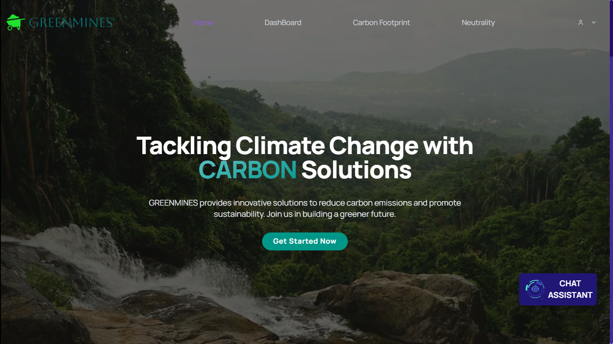
      
    <li><h2>Carbon Emission Estimation</h2></li>
    <ul>
        <li><h3>Electricity and Explosion Carbon Estimation</h3></li>
        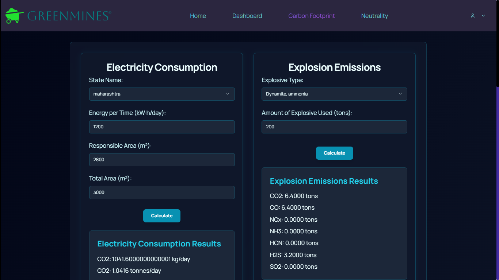
         
        <li><h3>Fuel and Shipping Carbon Estimation</h3></li>
        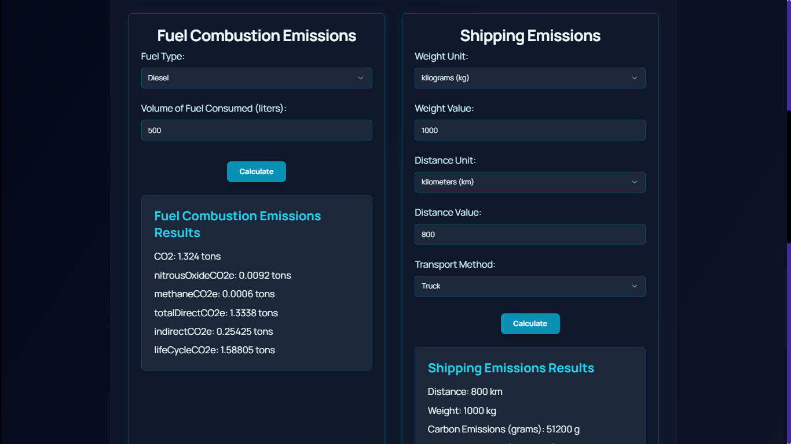
          
    </ul>
    <ul>
        <li><h3>New Dashboard Visualization</h3></li>
        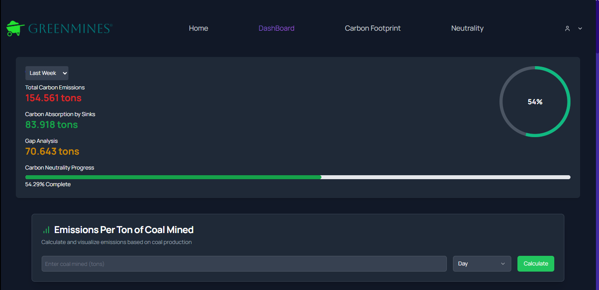
        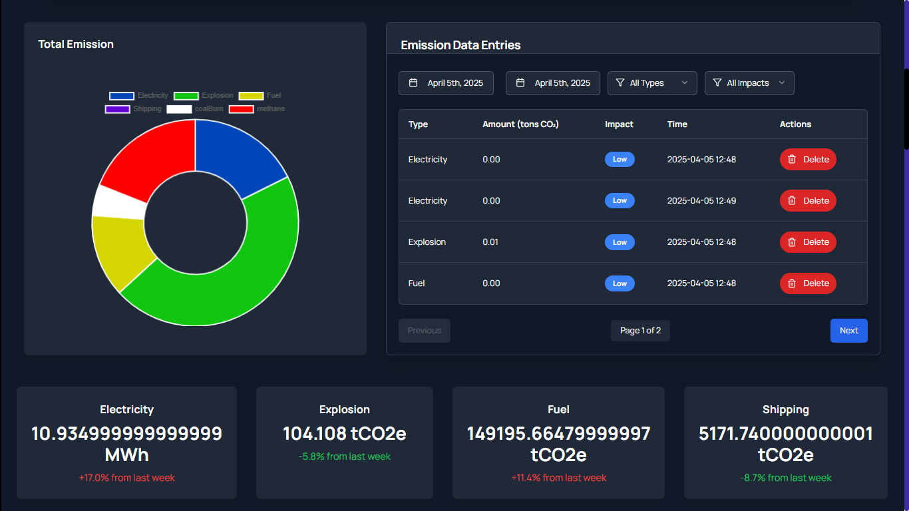
        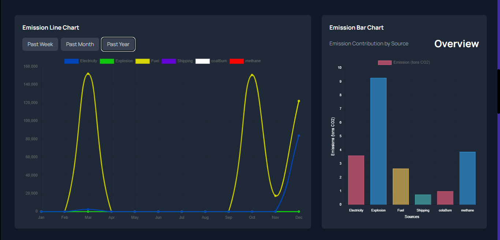
        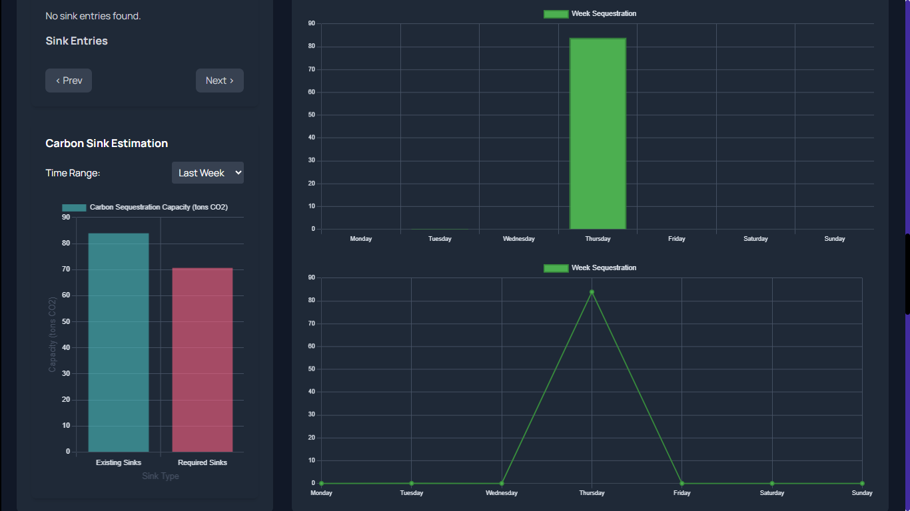
        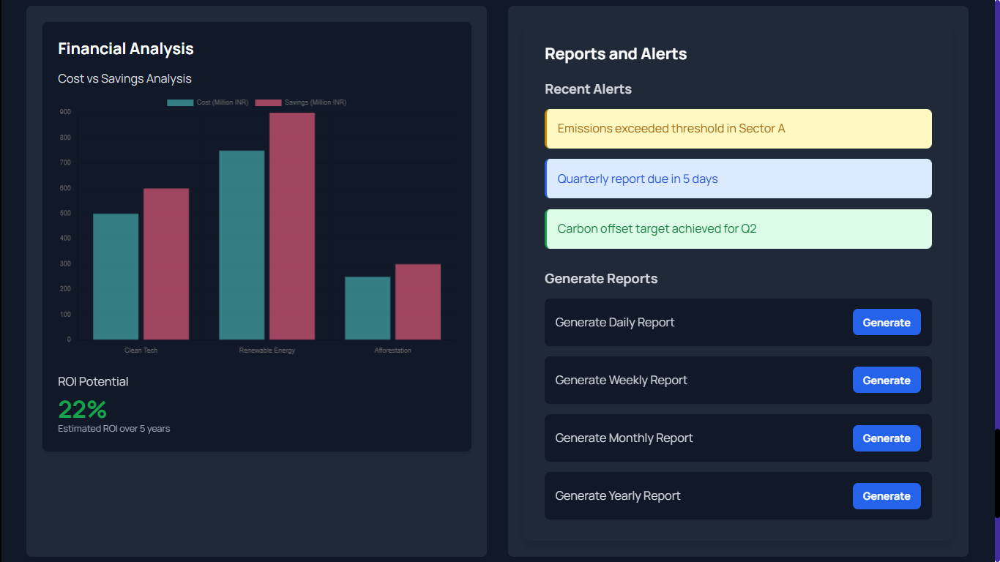
          
    </ul>
      
    <li><h2>Simulation Display</h2></li>
    <ul>
        <li><h3>Emission of the Mine</h3></li>
        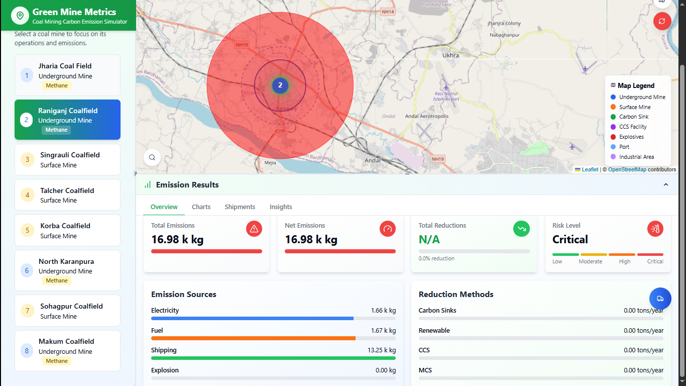
         
        <li><h3>Detailed Emission of the Mine</h3></li>
        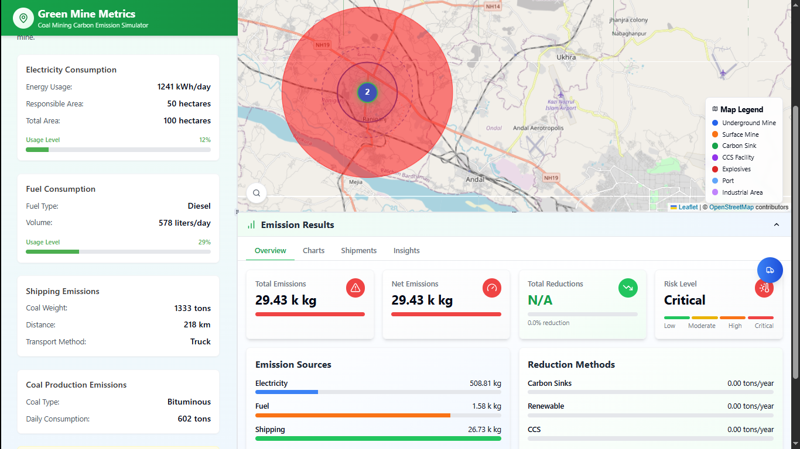
         
        <li><h3>Mine After Neutrality Pathways Implemented</h3></li>
        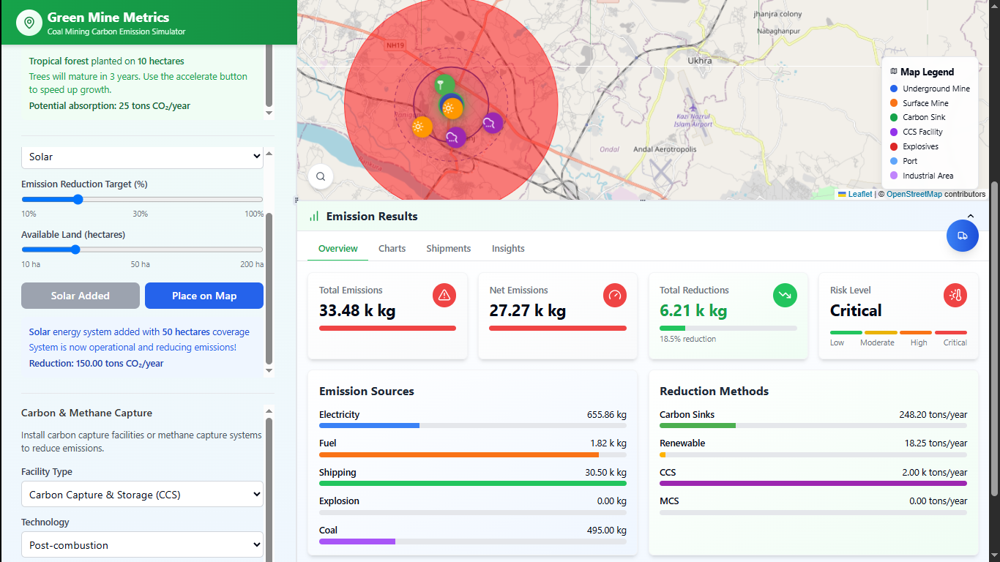
         
        <li><h3>Heat Map of the Mines</h3></li>
        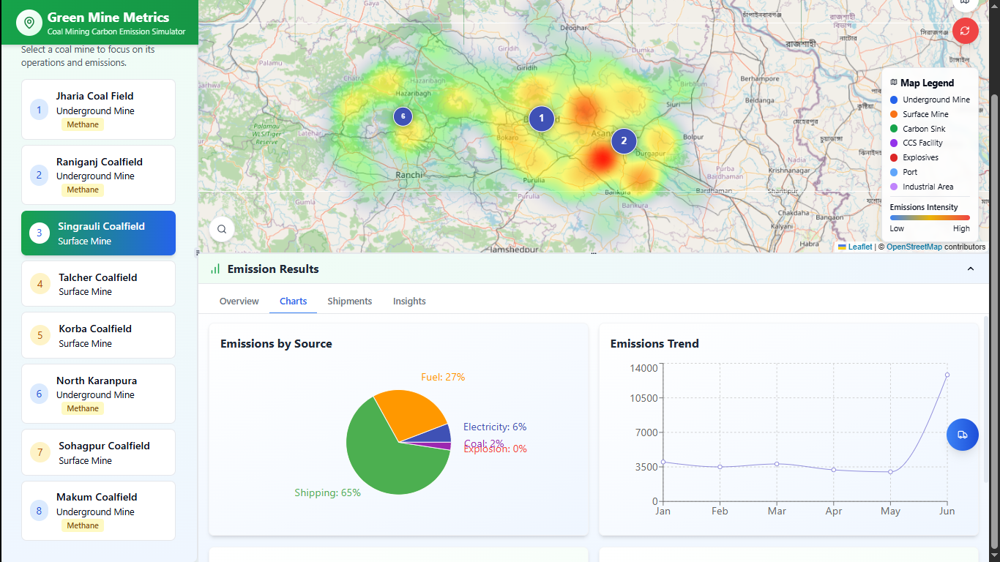
          
    </ul>
    <li><h2>Carbon Neutrality Pathways</h2></li>
    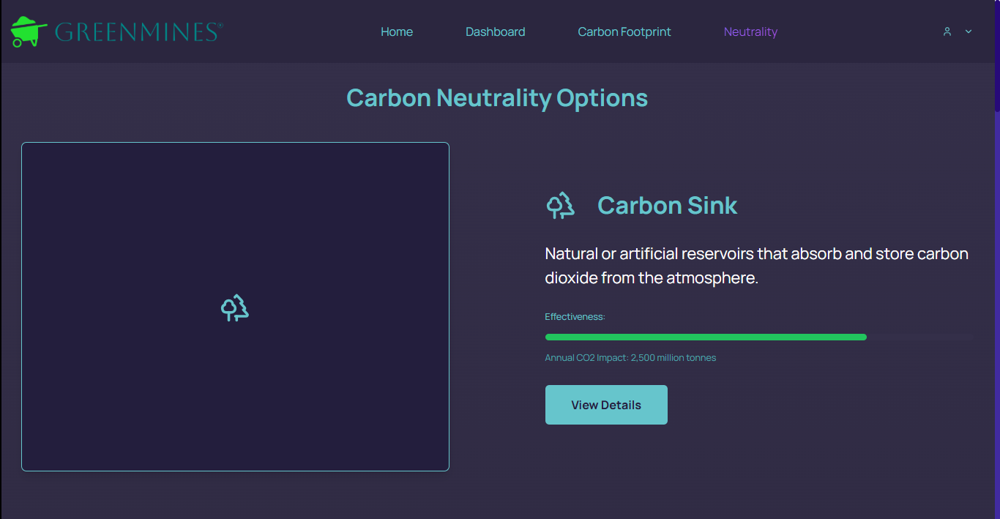
    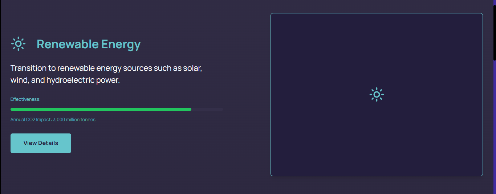
    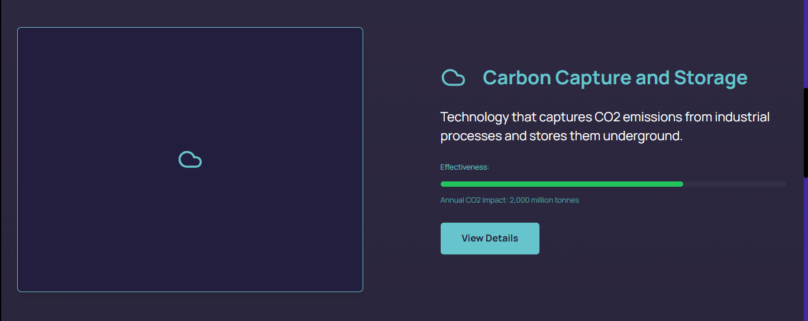
    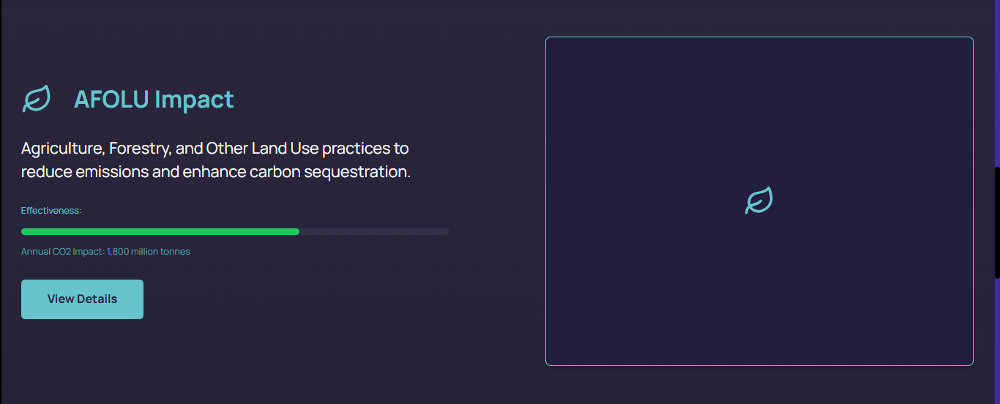
    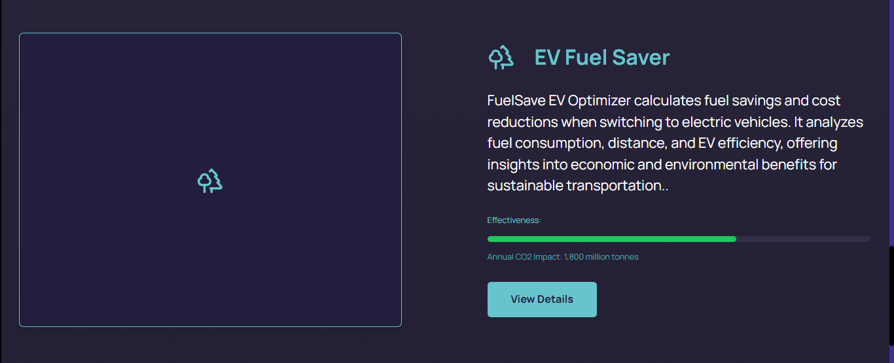
    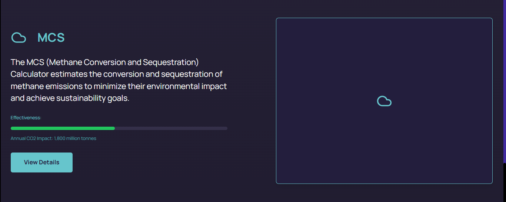
     
</ul>

---

Explore the application to discover a range of additional features designed to enhance carbon management in coal mining!
